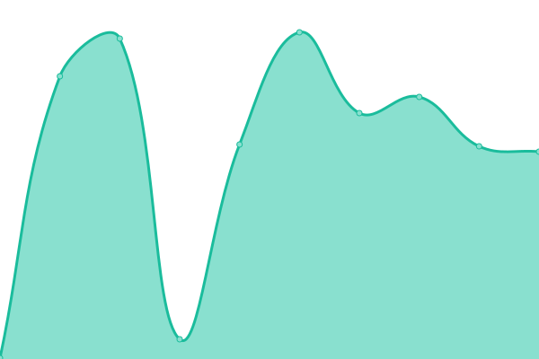
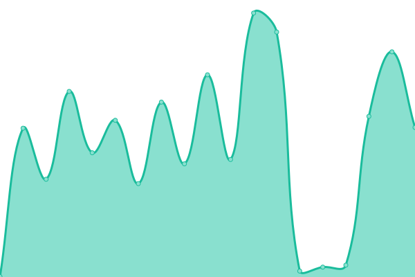

# [📈 Live Status](https://status.kloudbucket.com): <!--live status--> **KloudBucket is running perfectly.**

This repository contains the open-source uptime monitor and status page for [KodeHomeCom](https://status.kloudbucket.com), powered by [Upptime](https://github.com/upptime/upptime).

With [Upptime](https://upptime.js.org), you can get your own unlimited and free uptime monitor and status page, powered entirely by a GitHub repository. We use [Issues](https://github.com/KodeHomeCom/kloudbucketstatus/issues) as incident reports, [Actions](https://github.com/KodeHomeCom/kloudbucketstatus/actions) as uptime monitors, and [Pages](https://status.kloudbucket.com) for the status page.

<!--start: status pages-->
<!-- This summary is generated by Upptime (https://github.com/upptime/upptime) -->
<!-- Do not edit this manually, your changes will be overwritten -->
<!-- prettier-ignore -->
| URL | Status | History | Response Time | Uptime |
| --- | ------ | ------- | ------------- | ------ |
|  [KloudBucket Main](https://kloudbucket.com) | 🟩 Up | [kloud-bucket-main.yml](https://github.com/KodeHomeCom/kloudbucketstatus/commits/HEAD/history/kloud-bucket-main.yml) | 

 946ms
     
 | 

<a href="https://status.kloudbucket.com/history/kloud-bucket-main">100.00%</a>
    

|  [KloudBucket Blog](https://kloudbucket.com/blog) | 🟩 Up | [kloud-bucket-blog.yml](https://github.com/KodeHomeCom/kloudbucketstatus/commits/HEAD/history/kloud-bucket-blog.yml) | 

 383ms
     
 | 

<a href="https://status.kloudbucket.com/history/kloud-bucket-blog">100.00%</a>
    

|  [KloudBucket Contact](https://kloudbucket.com/contact) | 🟩 Up | [kloud-bucket-contact.yml](https://github.com/KodeHomeCom/kloudbucketstatus/commits/HEAD/history/kloud-bucket-contact.yml) | 

 338ms
     
 | 

<a href="https://status.kloudbucket.com/history/kloud-bucket-contact">100.00%</a>
    

|  [User Dashboard](https://kloudbucket.com/user/dashboard) | 🟩 Up | [user-dashboard.yml](https://github.com/KodeHomeCom/kloudbucketstatus/commits/HEAD/history/user-dashboard.yml) | 

 472ms
     
 | 

<a href="https://status.kloudbucket.com/history/user-dashboard">100.00%</a>
    

<!--end: status pages-->

[**Visit our status website →**](https://status.kloudbucket.com)

## 📄 License

- Powered by: [Upptime](https://github.com/upptime/upptime)
- Code: [MIT](./LICENSE) © [Anand Chowdhary](https://anandchowdhary.com), supported by [Pabio](https://pabio.com)
- Data in the `./history` directory: [Open Database License](https://opendatacommons.org/licenses/odbl/1-0/)
